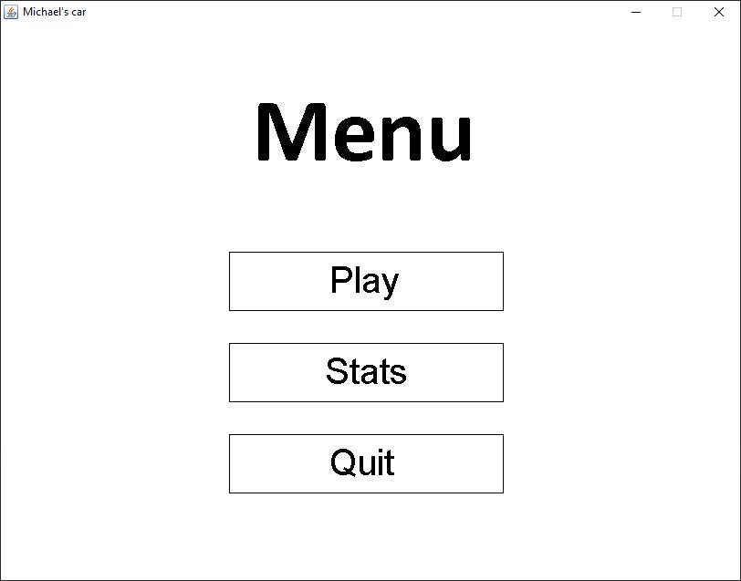
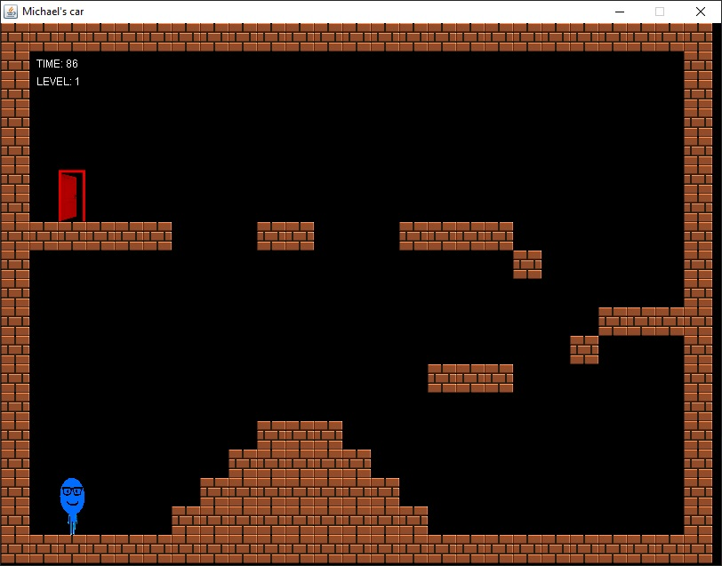
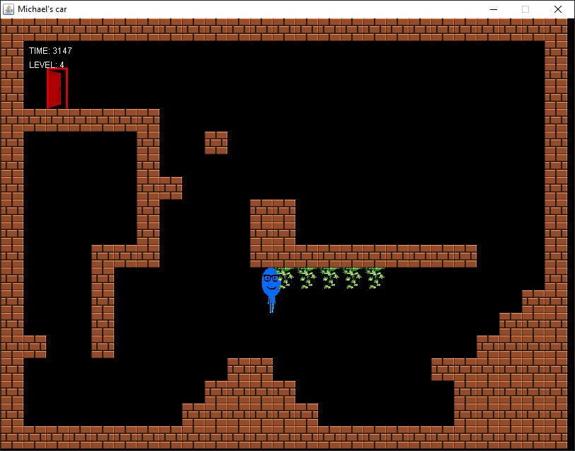
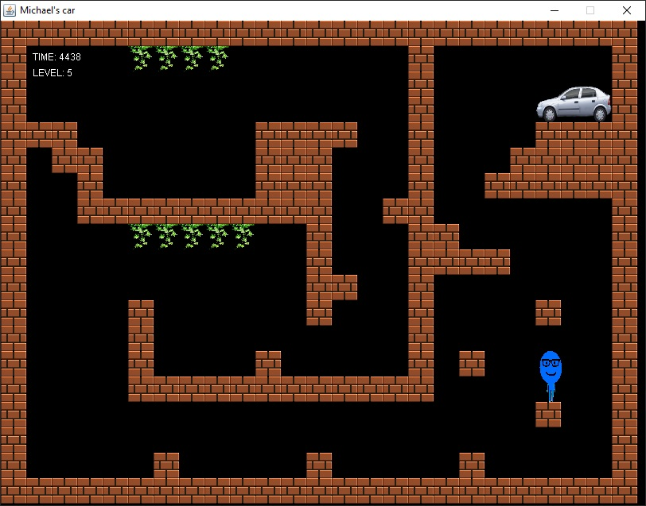

# Michael's car
Help Michael find his dream car. Complete the next levels and lead Michael to the end!

## Table of contents
* [General info](#general-info)
* [Screenshots](#screenshots)
* [Technologies](#technologies)
* [Setup](#setup)

## General info
A simple game that was created for the needs of a student project.

## Screenshots

## Technologies
* Java 7
* Swing
* AWT

## Setup
Compile and run Main method in Game class.